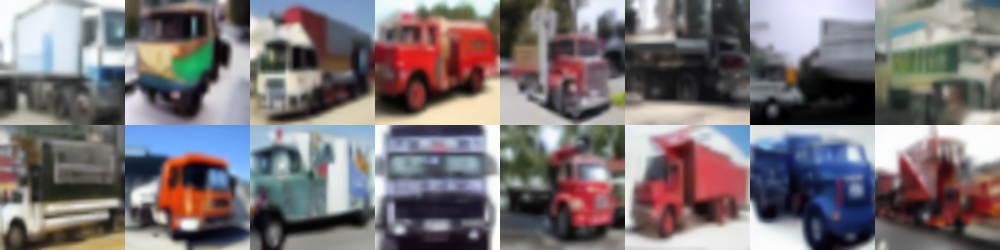

# Stable Diffusion Dataset Generation for Downstream Classification Tasks

This repository contains the code relative to the paper ["Stable Diffusion Dataset Generation for Downstream Classification Tasks"](https://arxiv.org/abs/2405.02698), _European Symposium on Artificial Neural Networks_ (ESANN) 2024


## Goal & Results

The goal of this work is to adapt a pre-trained Stable Diffusion implementation to make it generate an entire synthetic version of a dataset, suitable to be used in Downstream Classification Task.
Stable Diffusion is mainly used to generate few high-quality images given a textual prompt. After the adaptation pipeline, it is able to generate a desired number of different and heterogeneous images, specifying only the belonging class.

Results show that generated synthetic datasets are very similar to the real counterparts from a visual point of view and in a third of the studied cases larger synthtic datasets perform better than the original ones in the Downstream Classification Task.

The figures below show real and synthetic images for each class of Cifar10.

Class | Real Images                                       | Synthetic Images
---|---------------------------------------------------| ----
airplane|  | 
automobile|  | 
bird|  | 
cat|  | 
deer|  | 
dog|  | 
frog|  | 
horse|  | 
ship|  | 
truck|  | 

Other images can be found in folders [Data](Data/Synthetic) and [Images](Images).

### Optimization pipeline
The figure below shows that the optimization pipeline makes the Stable Diffusion model improve its ability to 
generate a suitable dataset for the classification task.  
The only step that does not always show improvement is the third one, but it is foreseeable because the hyperparameters
are not optimized for the Diffusion Model after the Fine-Tuning. In fact, after the final optimization we reach the best
CAS values for each dataset.


### CAS Results

The CAS results allows us to understand if synthetic datasets can replace real ones in the Downstream Classification Task.
For macro datasets (Cifar10, Cifar100), increasing the cardinality of the synthetic dataset helps the classifier to perform 
each step better (for Cifar10, even better than the real one).

**CIFAR10**  
  
**CIFAR100**  
  

For micro datasets, such as the Medical ones, the increasing cardinality cannot compensate for the lack of quality of 
generated images. So, future works can focus on improving the pipeline to obtain better results in such cases.  
However, this work is a first solution also to solve the data scarcity issue.  

**PATHMNIST**  
  
**RETINAMNIST**  
  

## Code Structure

The code is structured as followed:
- [SD_adapting.py](SD_adapting.py): code for adapting Stable Diffusion for our goal. It allows to perform either Transfer Learning of the new Class Encoder or Fine-Tuning of the pre-trained Diffusion Model
- [hyp_opt.py](hyp_opt.py): code for performing hyperparameters Bayesian optimization, either after Transfer Learning or Fine-Tuning, and/or visualize results
- [generate_dataset.py](generate_dataset.py): code for generating a synthetic dataset of the desired cardinality, specifying the original dataset and the hyperparameters
- [classifier_training.py](classifier_training.py): code for training a classifier using the real or a synthetic dataset and testing its performances on the real test set ([CAS](https://arxiv.org/abs/1905.10887))
- [result_plot.ipynb](result_plot.ipynb): Jupyter notebook for plotting results
- CAS Results: folder containing the test accuracies, the pipeline optimization accuracies progress and the CAS plots
- Checkpoints: folder containing the weights for the classifier trained, for each case, on the real dataset and for increasing size synthetic datasets and the best epochs weights for the Class Encoder and Diffusion Model (for each dataset)
- Data: folder containing the code for loading each studied dataset and some images for each synthetic dataset
- Models: folder containing the codes for loading the necessary Keras models (ResNet20, Stable Diffusion, Class Encoder)
- optimization plots: folder containing for each dataset and for both the optimization phases the graphs generated by the optimization tool
- Images: folder containing for each dataset real and synthetic image collages

### Requirements
To set up for the project, it's recommended to use a virtual environment to manage dependencies.
Follow these steps:

1. **Create a Virtual Environment** (if you haven't already):
```bash
   python -m venv venv
```
2. **Activate the Virtual Environment**:
- on Windows:
```bash
   venv\Scripts\activate
```
- on Linux/Mac:
```bash
   source venv/bin/activate
```
3. **Install Packages from** [requirements.txt](requirements.txt):
```bash
   pip install -r requirements.txt
```

### Usage
- SD_adapting.py:
  - --dataset: The target dataset for training. Choose from:
    - cifar10 (default)
    - cifar100 
    - pathmnist 
    - dermamnist 
    - bloodmnist
    - retinamnist
  - --train_model: The model component to train. Choose from:
    - enc: Text encoder (default) 
    - dif: Diffusion model
  - --enc_epoch: The epoch number from which to load pre-trained encoder weights. If 0 (default), training starts from scratch. 
  - --dif_epoch: The epoch number from which to load pre-trained diffusion model weights. If 0 (default), training starts from scratch. 
  - --exp: (Required) An experiment identifier (e.g., 0001). This is used to create a directory for saving model weights. 
  - --freq: The frequency (in epochs) at which to save model weights during training. Default 1
  
  Example: 
  ```bash
  python SD_adapting.py --dataset cifar10 --train_model enc --exp 0001 --enc_epoch 0
  ```
  
- hyp_opt.py:
  - --dataset: As above
  - --exp: As above
  - --optimize: Enable hyperparameter optimization using Optuna. To disable optimization, use --no-optimize.
  - --train_model: The model component to train. Choose from:
    - enc: Text encoder (Default)
    - dif: Diffusion model
  - --batch_size: The batch size for training (Default 256)
  - --enc_epoch: Epoch of the Class Encoder for second optimization step. (Default 0)
  - --num_imgs: The total number of images to generate during training. (Default 4000)
  - --is_1: The number of inference steps used during image generation. This is only required if --train_model dif is selected. (Default 50)
  - --ugs_1: The Unconditional Guidance Scale value, optimized after the first step. This is only relevant if --train_model dif is selected. (Default 7.5)
  - --save_plots: Save plots of the evaluation results. This option will generate and save visual representations of the training results.

  Example:
   ```bash
    python hyp_opt.py --dataset retinamnist --train_model dif --exp 0003 --optimize --is_1 15 --ugs_1 1.2 
  ```
  
- generate_dataset.py:
  - --dataset: As above
  - --exp: As above
  - --img_class: The number of images to generate per class. If None, this is automatically calculated based on --img_total 
  and the number of classes in the dataset.
  - --img_total: The total number of images to generate. If not specified, the number of images per class will be used.
  - --batch_size: The batch size for generating images. (Default 250)
  - --enc_epoch: The epoch number from which to load Class Encoder weights. (Default 50)
  - --dif_epoch: The epoch number from which to load Diffusion Model weights. (Default 10)
  - --inf_steps: The number of inference steps during image generation. (Default 50)
  - --ugs: The Unconditional Guidance Scale (UGS) value used for image generation. (Default 7.5)

Example:
   ```bash
    python generate_dataset.py --dataset cifar100 --img_total 40000 --enc_epoch 25 --dif_epoch 5 --inf_steps 20 --ugs 1.0 --exp 0001  
  ```

- classifier_training.py:
  - --dataset: As above
  - --exp: As above
  - --synthetic: Whether to use synthetic images for training. If True (Default), synthetic images will be used; otherwise, real images will be used.
  - --take: Size of the synthetic dataset with respect to the real one (Default 1)
  - --batch_size: The batch size for training. (Default 256)
  - --epochs: The number of epochs for training. (Default 100)
  - --classifier: The classifier architecture to use for training. (Default resnet20)
  - --train: Whether to perform training. If True (Default), the classifier will be trained on the dataset.
  - --test: --test: Whether to perform testing. If True (Default), the trained classifier will be evaluated on the test set.

Example:
   ```bash
    python classifier_training.py --dataset bloodmnist --synthetic True --take 4 --test False
  ```

## References
If you use this code, please consider citing the following paper:
```bibtex
@article{lomurno2024stable,
  title={Stable Diffusion Dataset Generation for Downstream Classification Tasks},
  author={Lomurno, Eugenio and D'Oria, Matteo and Matteucci, Matteo},
  journal={arXiv preprint arXiv:2405.02698},
  year={2024}
}
```